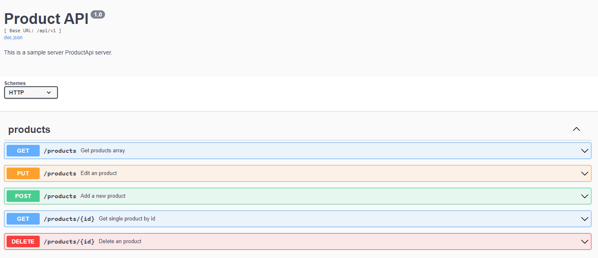

# Go RESTful API with Gin Web Framework & MongoDB
This is an example golang backend application using MongoDB database with clean architecture.

## Features
* Go Web Framework ([gin-gonic](https://github.com/gin-gonic/gin))
* Swagger ([swaggo](https://github.com/swaggo/swag))
* CRUD operations
* Mock: [golang/mock](https://github.com/golang/mock)
* Database: [MongoDB](https://www.mongodb.com/)
* Test Assertions: [stretchr/testify](https://github.com/stretchr/testify)

## Getting Started

```sh
# download the project
git clone https://github.com/aabdullahgungor/product-api.git

cd product-api
```

### Run the Project

```bash
go run main.go
```
### Access API using 

```bash
http://localhost:8000/api/v1
```

### Sample of Endpoints

- GET localhost:8000/api/v1/products
- GET localhost:8000/api/v1/products/:id
- POST localhost:8000/api/v1/products
- PUT localhost:8000/api/v1/products
- DELETE localhost:8000/api/v1/products/:id
  
### Sample API Requests and Responses

#### POST localhost:8000/api/v1/products
```bash
localhost:8000/api/v1/products
```
request body:
// We did not write the id number because we generate it automatically.
```bash
{
        "name": "Refrigerator 1",
        "price": 1000,
        "quantity": 3,
        "status": true,
        "date": "2016-10-20T00:00:00Z",
        "category_id": "5a30de130867edfa45711668",
        "brand": {
            "id": "641db6ba47413b86ecfae49a",
            "name": "Vestel"
        },
        "colors": [
            "red",
            "green",
            "blue"
        ]
    }
```
response body:
```bash
{
    "message": "Product has been created"
}
```
#### GET localhost:8000/api/v1/products/:id
```bash
localhost:8000/api/v1/products/641db6ba47413b86ecfae49b
```
response body:
```bash
{
    "id": "641db6ba47413b86ecfae49b",
    "name": "Mobile 1",
    "price": 45,
    "quantity": 4,
    "status": true,
    "date": "2016-10-20T00:00:00Z",
    "category_id": "5a30de130867edfa45711668",
    "brand": {
        "id": "641db6ba47413b86ecfae49a",
        "name": "Vestel"
    },
    "colors": [
        "red",
        "green",
        "blue"
    ]
}
```
#### PUT localhost:8000/api/v1/products
```bash
localhost:8000/api/v1/products
```
request body:
//we changed price and quantity
```bash
{
    "id": "641db6ba47413b86ecfae49b",
    "name": "Mobile 1",
    "price": 5000,
    "quantity": 20,
    "status": true,
    "date": "2016-10-20T00:00:00Z",
    "category_id": "5a30de130867edfa45711668",
    "brand": {
        "id": "641db6ba47413b86ecfae49a",
        "name": "Vestel"
    },
    "colors": [
        "red",
        "green",
        "blue"
    ]
}
```
response body:
```bash
{
    "message": "Product has been edited",
    "product_id": "641db6ba47413b86ecfae49b"
}
```
#### DELETE localhost:8000/api/v1/products/:id
```bash
localhost:8000/api/v1/products/64903edda330532bbb2614b2
```
// You can use the id number of the new product you added before. You must use GET products method to learn the id of new product

```bash
{
    "message": "Product has been deleted",
    "product_id": "64903edda330532bbb2614b2"
}
```
## Open API Doc Preview
http://localhost:8000/api/v1/swagger/index.html



## How to run the test?

```bash
# Run tests
go test ./controller -v
go test ./service -v
```
